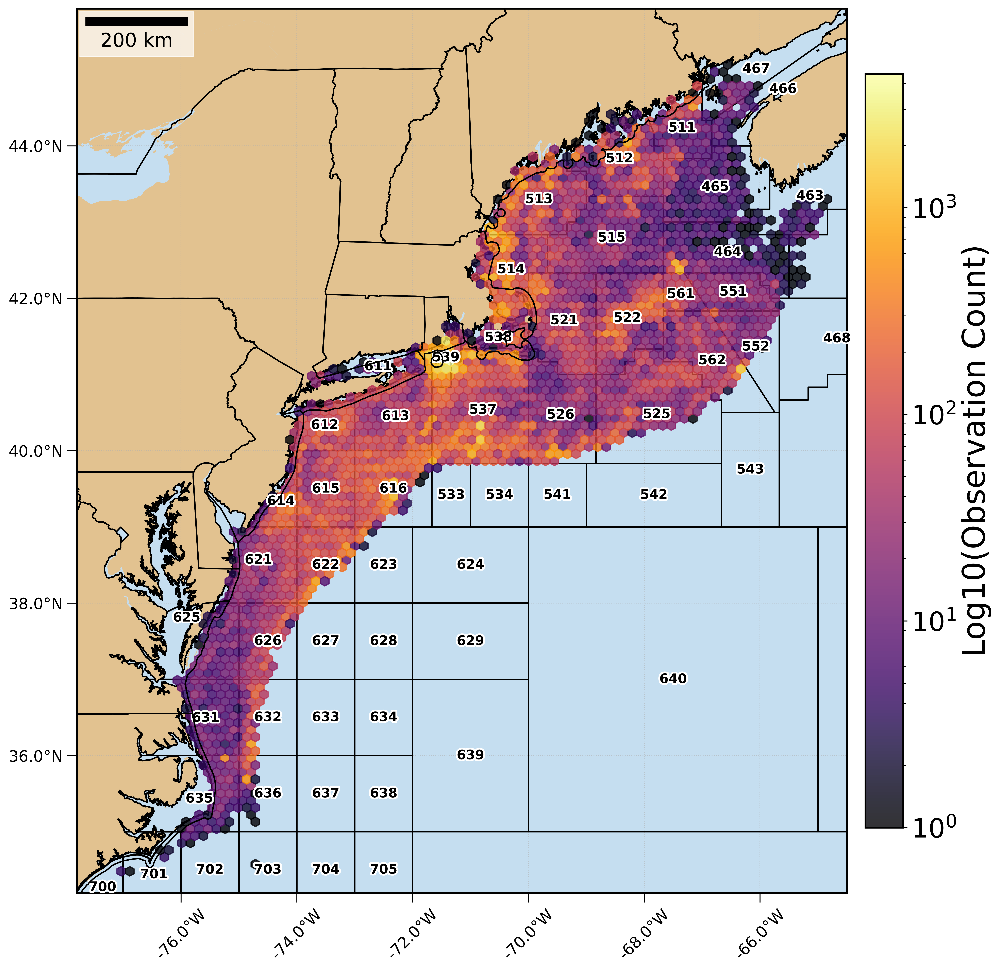

FIShBOT is a new exciting near-realtime product that we created to provide 
standardized daily bottom condition data. FIShBOT is updated every 24 hours
and currently includes temperature, salinity, and dissolved oxygen. 

The goal of this project is to increase the access to and utility of underwater
observations collected by fishing and science communities. Until now, this 
data existed primarily as largely disparate data sources and is now available 
as daily averages on a common standardized grid across the entire NE Continental 
Shelf. 

This product is still in development and we are excited to continue to 
watch it grow and think of more ways to serve it back to the folks who are 
collecting this critical data! 

Visit our [site](https://fishbot.net) to learn more! 

